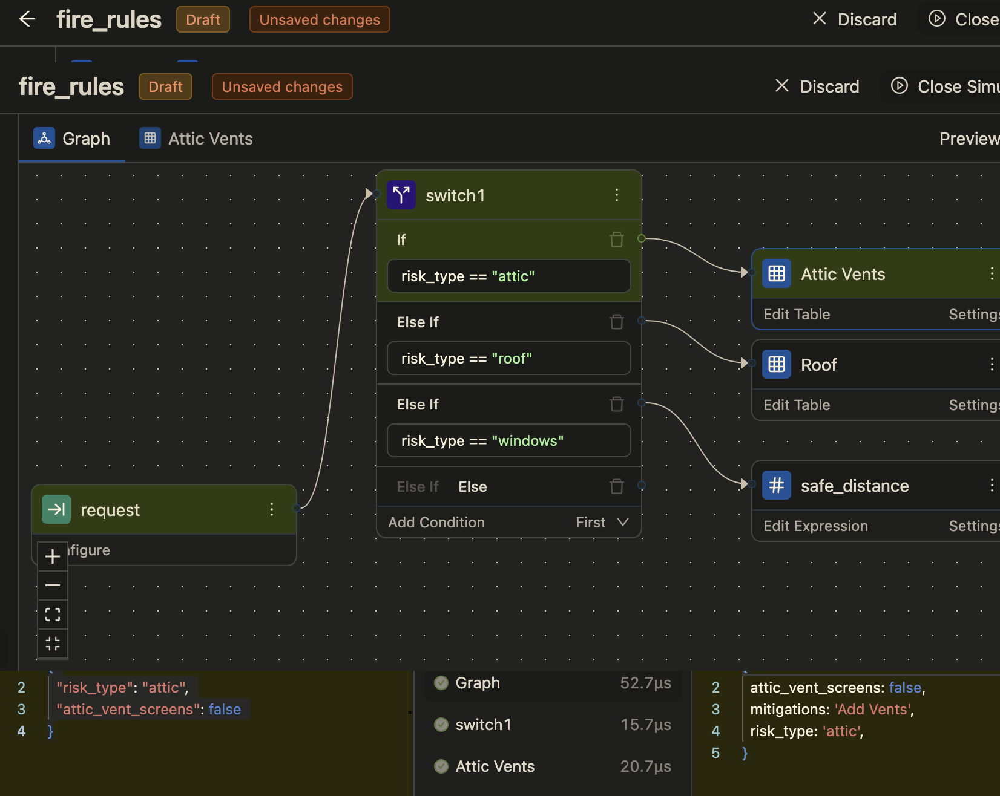
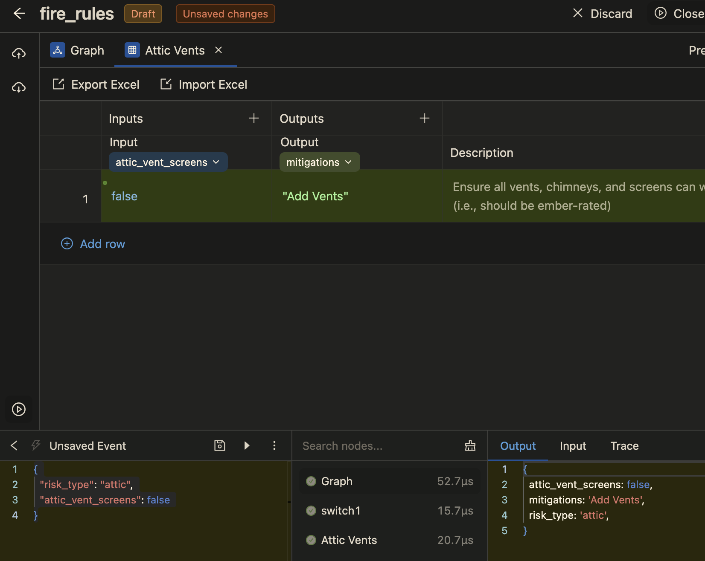

# Overview
GoRules BRMS is a Rules UI to create/edit/modify business rules, and also offers:
* Drag and drop widgets GUI
* Versioning
* Publishing
* Testing Playground

https://hub.docker.com/r/gorules/brms

## (Not So) Quickstart
* Obtain a license key from https://portal.gorules.io
* Edit `docker-compose.yml` and enter the `LICENSE_KEY`
* Start the container
```shell
docker-compose up
# http://localhost:9080/
```
* Create a Project
* Create a `New Decision`
* Open newly created decision
* Left sidebar towards top click on the `Up Arrow Cloud` icon and select `Upload JSON`
* Select the file `fire_risk.json` in the repository
* Click on `Edit Table` for Attic Vents in the `Graph` view
* Left sidebar towards bottom click on `Play` icon
* Click `+` icon and paste the following in the `Unsaved Event`
```json
{
  "risk_type": "attic",
  "attic_vent_screens": false
}
```
* Click the right triangle to submit the request
* Output will display a response and table will be highlighted with match rules criteria

## Graph View


## Rules View


Rules can be imported from 'Upload JSON' in the left sidebar and selecting `fire_risk.json`
